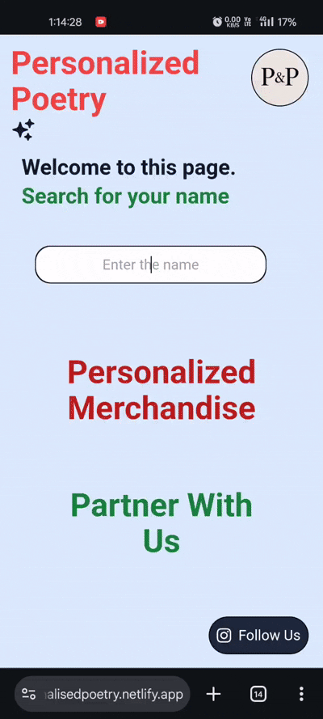

# Personalized Poem Generator ✍️🌈

A fun React web app that creates a poetic line for every letter in your name. Features animated input, dynamic themes from JSON, and smooth UX.


## Features
* Dynamic poem generation from user input
* Random theme styling on each entry
* Animated and responsive input field
* Deployed via Netlify

## Tech Stack
React · CSS · JSON · Netlify · GitHub

## Live Demo
🔗 [https://personalisedpoetry.netlify.app/]

## Getting Started

```bash
git clone https://github.com/mauryamj/personalized-poem.git
cd personalized-poem
npm install
npm run dev
